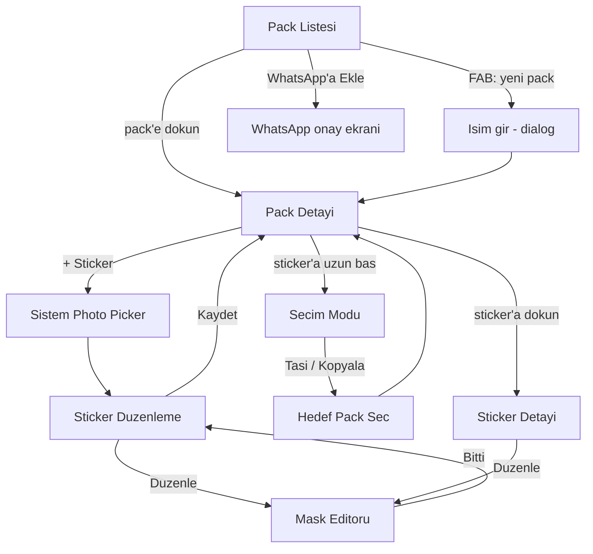

# StickerLab — Ekran Akışı

v1 kapsamının UI haritası. Kapsam kararları [STICKERLAB.md](STICKERLAB.md)'de;
burada sadece "kullanıcı ne görüyor, nereye gidiyor" var.

İki ilke:

**1. Hiçbir işlem otomatik değil.** Fotoğrafa yapılan her şey (arka plan silme
dahil) kullanıcının seçtiği bir işlem. Varsayılan davranış, fotoğrafı olduğu
gibi sticker formuna çevirmek.

**2. Kesim düzeltmek hızlı olmalı.** Otomatik kesim
kalitesinde rakiplerden ayrışılamıyor (hepsi aynı ML Kit modelini kullanıyor),
fark manuel rötuşta çıkacak. Aşağıdaki her karar "kaç dokunuşta istenen
sticker" sorusuna göre verildi.

---

## 1. Harita



Beş gerçek ekran + iki sistem ekranı (Photo Picker, WhatsApp onayı) + iki dialog.
Bilinçli olarak sığ: sticker üretimi en fazla **3 dokunuş** uzakta
(`+ Sticker` → foto seç → Kaydet).

---

## 2. Ekranlar

### 2.1 Pack Listesi — ana ekran

Uygulama açılışı. M6 ile tamamlandı.

| Öğe | İçerik |
|---|---|
| Satır | Tray icon (96px), pack adı, "N sticker", WhatsApp durum rozeti |
| Rozet | `N sticker daha gerekli` / `Pack dolu` |
| Aksiyon | Satıra dokun → detay. Butona dokun → WhatsApp'a ekle |
| FAB | Yeni pack |
| Boş durum | "Henüz pack yok" + tek buton |

**Kararlar:**

- WhatsApp'a ekleme butonu **liste seviyesinde** kalıyor, detaya gömülmüyor.
  En sık tekrarlanan iş; bir seviye derine koymak maliyet.
- **`Eklendi` rozeti henüz yok.** WhatsApp'ın
  `sticker_whitelist_check` provider'ına sorulacaktı; M6'da yapılmadı, cila adımı
  olarak duruyor. Yapılırsa sorgu başarısız olduğunda rozet hiç gösterilmemeli —
  yanlış bilgi göstermektense göstermemek yeğ.
- Max 10 pack: 10'a ulaşınca FAB disable + sebep.

### 2.2 Pack Detayı

Sticker grid'i (3 sütun, kare hücreler, şeffaflık için damalı zemin).

| Öğe | İçerik |
|---|---|
| Üst bar | Pack adı (dokun → yeniden adlandır), overflow: tray değiştir, pack sil |
| Grid | Sticker'lar + son hücrede `+ Sticker` |
| Alt bar | Yalnız seçim modunda: Taşı / Kopyala / Sil |
| Uyarı şeridi | 3'ten az sticker varsa: "WhatsApp'a eklemek için N sticker daha gerekli" |

**Kararlar:**

- Sticker'a **dokun** → detay; **uzun bas** → seçim modu. Standart Android davranışı.
- Pack adı değişse bile `identifier` sabit kalıyor (UUID). Görünmez ama yeniden
  adlandırma WhatsApp'taki pack'i sıfırlamasın diye kritik.
- Tray icon varsayılan olarak ilk sticker'dan 96×96 üretiliyor; kullanıcı
  overflow'dan başka bir sticker'ı tray yapabiliyor. Ayrı tray seçme akışı yok —
  kişisel kullanım için fazla.

### 2.3 Sticker Düzenleme

Photo Picker'dan dönünce açılır. Seçilen fotoğraf **olduğu gibi** gösterilir.

> **Hiçbir işlem otomatik çalışmaz.** Arka plan silme dahil, fotoğrafa yapılan
> her şey kullanıcının seçtiği bir işlemdir. Hiçbiri seçilmezse Kaydet, fotoğrafı
> ham hâliyle sticker formuna çevirir (512×512 tuvale ortalanır).
>
> Gerekçe: kullanıcı her zaman arka planı silmek istemiyor. Otomatik çalıştırmak
> kararı kullanıcıdan alıyor, üstelik modeli gereksiz yere indirtiyor ve her
> fotoğrafta birkaç saniye bekletiyor.

**İşlemler** (listeye zamanla eklenecek):

| İşlem | Durum | Geri alınabilir |
|---|---|---|
| Arka planı sil | M3 ✅ | Evet — "Arka planı geri getir" |
| Rötuş (sil / geri getir fırçası) | M4 tamam | Undo / redo |
| Lasso | M5 tamam | Undo / redo |
| Renkli kalem | M7 tamam | Undo / redo |
| Metin ve emoji | M7 tamam | Undo / redo |

Aksiyonlar: işlem butonları · **Kaydet** · **Vazgeç**.

| Durum | Ekran |
|---|---|
| Fotoğraf yükleniyor | Spinner |
| Düzenleme | Önizleme + işlem butonları + Kaydet |
| İşlem sürüyor | Önizlemenin üstünde yarı saydam katman + açıklama |
| Model indiriliyor | "Bu sadece ilk seferde oluyor" — yalnız arka plan silme seçilirse |
| Özne bulunamadı | Snackbar; fotoğraf değişmez, akış tıkanmaz |

**Kararlar:**

- Orijinal fotoğraf bellekte tutuluyor; her işlem geri alınabilir olmalı.
- Kaydet'e basınca emoji sorulmuyor. WhatsApp en az 1 emoji istiyor, varsayılan
  `😀` atanıyor; kullanıcı sticker detayından değiştirebiliyor. Zorunlu emoji
  adımı akışı 3 dokunuştan 5'e çıkarırdı, karşılığında bir şey kazandırmıyor.
- Model indirme başarısızsa uygulama kilitlenmiyor; işlem uygulanmamış sayılır
  ve fotoğraf olduğu gibi kalır.

### 2.4 Sticker Editörü — projenin ana ekranı

Tam ekran, modal. En büyük parça (M4) ve fark yaratılacak yer.

```
+------------------------------+
| x            [<] [>]    Bitti|  ust bar
+------------------------------+
|                              |
|         canvas               |  zoom + pan, damali zemin
|      (gorsel + mask)         |
|                              |
+------------------------------+
|    o---------  firca boyutu  |  aktif arac fircaysa
+------------------------------+
|  [renk paleti]               |  kalem/metin secildiyse
|  [Sil][Geri getir][Kalem][Metin] |  arac
|  [Firca] [Lasso]             |  sadece sil/geri getir icin
+------------------------------+
```

| Araç | Davranış |
|---|---|
| Sil fırçası | Maskeye siyah boyar |
| Geri getir fırçası | Maskeye beyaz boyar |
| Lasso | Serbest çizilen kapalı `Path`; parmak kalkınca içi **seçili araca göre** silinir ya da geri getirilir |
| Undo / redo | Fırça darbesi listesi (aşağıdaki sapma notuna bakın) |
| Kalem | Overlay katmanına renkli serbest çizgi |
| Metin / emoji | Yazıp onaylayınca görünen alanın ortasına yerleşir ve **seçili kalır**: tek parmak taşır, iki parmak boyutlandırır. Bırakılan metne dokunmak onu geri seçer, boşluğa dokunmak seçimi bırakır |
| Zoom / pan | İki parmak. Tek parmak her zaman çizim |

**Kararlar:**

- **Tek parmak = çizim, iki parmak = zoom/pan.** Mod düğmesi yok. Rakiplerin
  çoğunda "el aracı"na geçmek gerekiyor; en çok zaman kaybettiren şey bu.
  İkinci parmak inince başlamış fırça darbesi **iptal edilip geri sarılıyor** —
  yoksa her zoom denemesi bir leke bırakırdı.
- Boyut slider'ı sadece fırça seçiliyken görünür; lasso'da yer kaplamaz.
- "Bitti" mask'i uygular; kapatırken değişiklik varsa onay sorar.
- Editör tam çözünürlükte değil, en fazla 1280 px kenarda çalışıyor. Çıktı
  zaten 512×512; fırça her dokunuşta bitmap'e yazdığı için büyük görselde
  akıcılık düşüyordu.

**Motor notu — iki katman.** M7'de motor maske modelinden katman modeline geçti:

- **Maske**: orijinal fotoğrafın hangi pikselinin görüneceğini söyler. Sil ve
  geri getir burayı boyar; geri getirmenin arka planı gerçekten geri
  getirebilmesi buna bağlı.
- **Overlay**: orijinalde olmayan pikseller — renkli kalem, metin, emoji.
  Maskeden bağımsız, en üstte.

Sonuç = (orijinal ∩ maske) + overlay.

Silgi overlay'e dokunmuyor: maske "fotoğrafın neresi görünsün", overlay "üstüne
ne çizildi" sorusunu yanıtlıyor. Kalem hatası geri alma ile düzeltilir.

Tüm işlemler tek sıralı listede; undo listenin sonunu atıp katmanları baştan
çiziyor. Lasso (M5) ve kalem/metin (M7) bu yapı sayesinde ucuz geldi.

**Metin ve emoji aynı özellik**: kullanıcı klavyeden emoji de yazabiliyor,
ayrıca sık kullanılanlar için kısayol satırı var. Ayrı bir emoji aracı yok.

**Seçili metin jestleri devralır.** Bir metin seçiliyken iki parmak tuvali
değil metni boyutlandırır; seçim bırakılınca (araç değişince ya da "Bitir")
iki parmak yine resmi yakınlaştırır. İlk denemede "yaz, sonra tuvale dokunarak
yerleştir" akışı vardı; taşımak isteyen her dokunuş metnin bir kopyasını daha
ekliyordu. Jest katmanı artık Compose UI testleriyle korunuyor.

Metin aracı seçiliyken tuval bir çizim yüzeyi değil, metinlerin yüzeyi: dokunuş
metnin üstündeyse onu seçer, boşluktaysa seçimi bırakır. Üst üste binen
metinlerde en son eklenen kazanır.

**Uygulamada üç sapma** (M4–M5'te alındı, gerekçeleriyle):

| Plan | Gerçekleşen | Neden |
|---|---|---|
| 8-bit grayscale mask | ARGB_8888 | ALPHA_8 hedefli Canvas çizimi ve Compose'da render edilmesi cihazdan cihaza değişebiliyor. 1280 px sınırında fark 4 MB |
| Undo = mask snapshot stack | Undo = fırça darbesi listesi | Snapshot adım başına ~5 MB tutardı. Darbeler birkaç yüz nokta; undo'da maske tabandan yeniden çiziliyor, milisaniyeler sürüyor |
| Araç çubuğu [Sil][Geri getir][Lasso] | İki eksen: [Sil/Geri getir] + [Fırça/Lasso] | Tek sırada lasso'nun silme mi geri getirme mi olduğu belirsizdi, ayrım uzun basmaya bağlanacaktı. İki eksen hem açık hem motorun yapısına birebir oturuyor |

**Büyüteç (loupe) yapılmayacak.** Dokümanın ilk halinde parmağın altında kalan
bölgeyi büyüten bir pencere vardı. Cihazda denendikten sonra iptal edildi: iki
parmak zoom aynı ihtiyacı karşılıyor ve ekranda kalıcı yer kaplamıyor. Fırça
sınırını gösteren imleç yeterli.

### 2.5 Sticker Detayı

**Ayrı ekran değil, dialog olarak yapıldı** (M6). Tek sticker için gereken
alan bir dialog'a sığıyordu; ayrı ekran gezinme maliyeti getirip karşılığında
bir şey vermiyordu.

- Emoji alanı (noktalı virgülle ayrılmış, en az 1)
- Açıklama (accessibility text) alanı
- **Tray ikonu yap** · **Sil**

Mevcut sticker'ı mask editöründe yeniden düzenlemek henüz yok — editör şu an
sadece yeni sticker akışından açılıyor.

Her değişiklikten sonra pack'in `imageDataVersion` artar ve `notifyChange()`
çağrılır; yoksa WhatsApp eski görseli göstermeye devam eder.

---

## 3. Kritik akışlar

### 3.1 Taşıma / kopyalama

En çok kural içeren akış:

1. Pack detayında uzun bas → seçim modu
2. Taşı veya Kopyala → hedef pack listesi (mevcut pack listede yok)
3. Onay

**UI'ın engellemesi gerekenler:**

| Kural | UI davranışı |
|---|---|
| Kaynak pack 3'ün altına düşecekse | **Taşı** disable, sebep gösterilir. Kopyala serbest |
| Hedef pack 30'u aşacaksa | Hedef listede disable, "dolu" etiketi |
| Aynı sticker iki pack'te | İki ayrı WebP dosyası; DB'de kaynak görsel paylaşımlı, export'ta kopyalanır |
| Taşıma iki pack'i etkiler | **Hem kaynak hem hedef** pack'in `imageDataVersion` artar + `notifyChange()` |

Bu tablo doğrudan STICKERLAB.md'deki 2. ve 3. tuzaktan geliyor. Engellenmezse
WhatsApp'ta sessizce bozuluyor.

M6'da uygulandı ve testle sabitlendi (`StickerRepositoryTest`, 14 test).
Kurallar `PackRules` içinde tek yerde: UI butonları kapatmak için, repository
son savunma olarak aynı fonksiyonları çağırıyor. Hepsini taşımak (kaynakta 0
kalması) serbest — boş pack normal bir durum, yeni oluşturulan pack de boş.

### 3.2 WhatsApp'a ekleme

Liste ekranındaki butondan. Sonuç ne olursa olsun `resultCode` ve
`validation_error` Snackbar'a ve Logcat'e yazılır (M1'de kurulu).

Provider tek sorgu bile almıyorsa sebep neredeyse her zaman package visibility —
bkz. STICKERLAB.md, Bilinen Tuzaklar #9.

---

## 4. Kural kaynaklı UI kısıtları

WhatsApp bunları ihlal edince hata vermiyor, sessizce reddediyor. Hepsi UI'da
önden engellenmeli:

| Kural | Nerede engellenir |
|---|---|
| Pack'te min 3 sticker | Ekle butonu + taşıma seçimi |
| Pack'te max 30 sticker | `+ Sticker` disable |
| Uygulamada max 10 pack | FAB disable |
| Sticker başına ≥ 1 emoji | Varsayılan `😀`, emoji listesi boşaltılamaz |
| Sticker başına ≤ 3 emoji | Emoji seçicide sayaç |

512×512 / 100 KB / 96×96 tray limitleri UI'da değil, export pipeline'ında (M2)
çözülüyor — kullanıcı hiç görmüyor.

---

## 5. v1'de bilerek olmayanlar

- Boş canvas'a çizim (v2 — v1 altyapısıyla hiçbir şey paylaşmıyor)
- Animasyonlu sticker (v2 — +25MB APK maliyeti)
- Sticker'a çerçeve/gölge efekti
- Pack paylaşma / dışa aktarma
- Onboarding, tutorial — kullanıcı sayısı iki haneli, gerekmiyor

---

## 6. Milestone eşleşmesi

| Ekran | Milestone |
|---|---|
| Pack Listesi (iskelet) | M1 — tamam |
| Sticker Düzenleme, Photo Picker | M3 — tamam |
| Mask Editörü (fırça, undo, zoom/pan) | M4 — tamam |
| Mask Editörü (lasso) | M5 — tamam |
| Editör: renkli kalem, metin, emoji | M7 — tamam |
| Pack Detayı, Sticker Detayı, taşıma | M6 — tamam |
| Pack Listesi (çoklu pack, tray ikonları) | M6 — tamam |

M2 (WebP export) görünür ekran üretmiyor ama M3'ten itibaren her kaydetme
işlemi onun üstünde çalışıyor.
